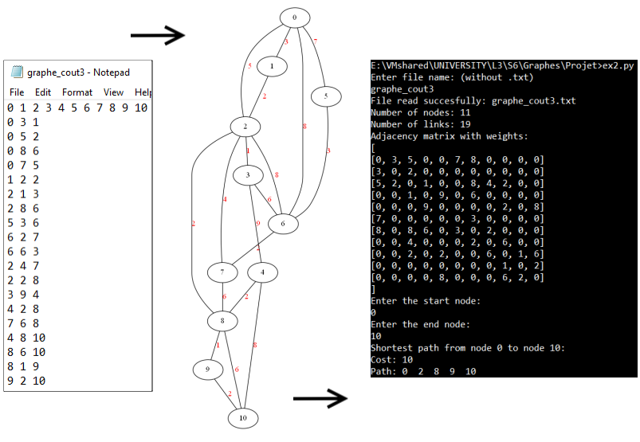

<h1 align="center"> Graph Theory </h1>
<br>

<p align="center">
  
</p>


>## Project:
For this project we had to implement 3 algorithms: 

- Strongly connected components https://www.geeksforgeeks.org/strongly-connected-components/
- Dijkstra https://en.wikipedia.org/wiki/Dijkstra%27s_algorithm
- Welsh-Powell https://en.wikipedia.org/wiki/Graph_coloring

<h2 align="center"> Graph structure </h2>
Our graphs are represented by text files, the first line contains the name of the nodes and the following lines indicate the different edges in the graph. For example the second line of this text file indicates that there is an edge between the node 0 to the node 3 (undirected graph).

<p align="center">
  
  
</p>

For Dijkstra's algorithm the "cost" of each edge has to be taken into account for this reason separate text files are used for this algorithm (graphe_cout1, graphe_cout2 & graphe_cout3) ("cout" meaning cost in French 🇫🇷 ). These files have a third parameter on the lines indicating the cost. For example the second line of this text file indicates that there is an edge between the node 0 and the node 1 with a cost of 1 (undirected graph).

<p align="center">
  
  
</p>

<h2 align="center"> Strongly connected components </h2>
<p align="center">
  
</p>

<h2 align="center"> Dijkstra </h2>
<p align="center">
  
</p>

<h2 align="center"> Welsh-Powell </h2>
<p align="center">
  
</p>


Completed in the third year of my Computer Science degree at the F.S.T Limoges (France) with Yoann SOCHAJ.

Class: Theorie des graphes

>## Features:
- Visual representation of the Welsh-Powell algorithm with pydot.
```
pip install pydot
```

>## Technology used:
Python: https://www.python.org/

>## Authors:
- Matt TAYLOR
- Yoann SOCHAJ [(GitHub profile)](https://github.com/YoannSo)

>## Useful Links:
Project report: [TAYLOR_SOCHAJ_Théorie des Graphes.pdf](TAYLOR_SOCHAJ_Th%C3%A9orie%20des%20Graphes.pdf)
